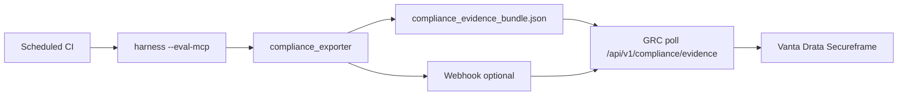

# Nexus Shield Compliance Readiness Guide

Technical guide for mapping Nexus Shield **on-device runtime protection**, **OWASP-aligned detections**, and **automated harness proofs** to enterprise GRC workflows (Vanta, Drata, Secureframe) and audit frameworks (**SOC 2**, **ISO 27001**).

---

## 1. Architecture & privacy model (auditor narrative)

| Property | Nexus Shield posture |
|----------|----------------------|
| **Inspection location** | Sub-millisecond **on-device** token / tool-call inspection at the agent runtime boundary |
| **Cloud proxy** | **Not required** for block/allow decisions (`external_cloud_proxy: false` in evidence metadata) |
| **Data residency** | Customer-controlled runtime; prompts/tool args stay in the deployment boundary |
| **Suitability** | Restricted enterprise, public sector, defense-adjacent / critical infrastructure patterns |

Optional SaaS dashboard (Proof Center) is a **read-only telemetry surface**; continuous compliance evidence is generated from the **open harness** and the **`/api/v1/compliance/evidence`** API.

---

## 2. Evidence artifacts

| Artifact | Producer | Contents |
|----------|----------|----------|
| `results/mcp_leaderboard.json` | `python -m runners.mcp_runner` | MCP-SEC-SCORE, block rate, OWASP tags per scenario |
| `results/scorecard_2026.json` | `python scripts/eval_scorecard.py` | Shadow AI / insecure-defaults benchmark |
| `results/compliance/compliance_evidence_bundle.json` | `python -m runners.compliance_exporter` | SOC 2 / ISO mapped control rows + integrity hash |
| `results/compliance/compliance_controls.csv` | same | GRC-friendly control export |
| `results/compliance/compliance_scenarios.csv` | same | Scenario-level OWASP + evidence hashes |

---

## 3. Automated export (CI / local)

```bash
# 1) Refresh benchmarks
cd harness
python scripts/run_reproducible_benchmark.py --eval-mcp
python scripts/run_reproducible_benchmark.py --eval-scorecard

# 2) Build compliance bundle
python -m runners.compliance_exporter --output-dir results/compliance

# 3) Optional — notify dashboard webhook after export
curl -X POST https://nexusshield.ai/api/webhooks/compliance \
  -H "Content-Type: application/json" \
  -H "x-nexus-signature: $(python -c 'import hashlib,os; b=open(0).read(); print(hashlib.sha256(f\"{os.environ[\"COMPLIANCE_WEBHOOK_SECRET\"]}.{b}\".encode()).hexdigest())' <<< '{\"event\":\"compliance.export.completed\",\"sha256\":\"...\"}')" \
  -d '{"event":"compliance.export.completed","sha256":"<bundle-sha256>"}'
```

Docker:

```bash
docker run --rm ghcr.io/baturhantasdelen-sudo/harness:latest --eval-mcp
docker run --rm ghcr.io/baturhantasdelen-sudo/harness:latest --eval-scorecard
docker run --rm --entrypoint python ghcr.io/baturhantasdelen-sudo/harness:latest \
  -m runners.compliance_exporter --output-dir results/compliance
```

---

## 4. GRC platform ingestion (Vanta / Drata / Secureframe)

Configure a **custom evidence collector** or **HTTP monitor** to poll:

```http
GET /api/v1/compliance/evidence
Authorization: x-compliance-monitor-token: <COMPLIANCE_MONITOR_TOKEN>
```

Or use an organization **`x-api-key`** (same as Action Firewall API).

**CSV controls export:**

```http
GET /api/v1/compliance/evidence?format=csv
```

Response headers:

- `X-Evidence-SHA256` — integrity digest for change detection
- `Cache-Control: no-store`

### Suggested control mapping

| Automated control ID | Framework | Evidence field |
|---------------------|-----------|----------------|
| CC7.1 | SOC 2 | `mcp_benchmark.block_rate_pct` |
| CC7.2 | SOC 2 | `mcp_benchmark.blocked_count` |
| A.8.8 | ISO 27001 | `mcp_benchmark.mcp_sec_score` |
| A.8.9 | ISO 27001 | `scorecard.headline_stats.ootb_defense_rate_avg_pct` |
| A.5.23 | ISO 27001 | `runtime_privacy.external_cloud_proxy === false` |
| AIR-01 | Nexus AI Risk | Shadow AI scorecard coverage |
| AIR-02 | Nexus AI Risk | `owasp_coverage.unique_genai_tags` |

Tags in JSON are **mapping aids**, not a formal OWASP certification.

---

## 5. Continuous compliance loop



**Recommended frequency:** daily for production agent fleets; on every release for MCP adapter changes.

**Failure criteria (example policy):**

- `mcp_benchmark.block_rate_pct` < 99.0 → alert
- `mcp_benchmark.mcp_sec_score` < 93 → alert
- Missing OWASP tags on any scenario → alert

---

## 6. Environment variables (dashboard)

| Variable | Purpose |
|----------|---------|
| `COMPLIANCE_MONITOR_TOKEN` | Shared secret for GRC polling (`x-compliance-monitor-token`) |
| `COMPLIANCE_WEBHOOK_SECRET` | HMAC secret for `POST /api/webhooks/compliance` |

---

## 7. Related documentation

- [SECURITY.md](../SECURITY.md) — OWASP references & vulnerability reporting
- [docs/benchmark](https://nexusshield.ai/docs/benchmark) — MCP-SEC-SCORE methodology
- [/scorecard](https://nexusshield.ai/scorecard) — 2026 Shadow AI scorecard
