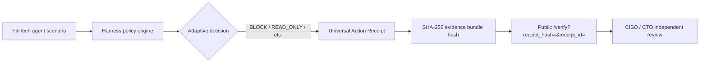

# Detect & Demonstrate (Bul ve Göster) — Independent Verification Proof

This document describes how Nexus Shield simulates a FinTech agent attack, intercepts it with runtime governance, and produces a **Universal Action Receipt (UAR)** that anyone can review on the public **`/verify`** route — without logging into the vendor dashboard.

**Live demo page:** [nexus-shield-dashboard.vercel.app/demo](https://nexus-shield-dashboard.vercel.app/demo)  
**Report context:** [State of Agent Security 2026](https://www.nexusshield.ai/reports/state-of-agent-security-2026)

---

## 1. Architecture overview



| Layer | Responsibility | Repo location |
|--------|----------------|---------------|
| **Simulation** | Reproducible attack narrative (prompt injection → tool exfil) | `scripts/simulate_independent_demo.py` |
| **Governance** | Deterministic ALLOW / BLOCK / READ_ONLY / REQUIRE_APPROVAL | `harness/core/policy_engine.py` |
| **Receipt schema** | UAR fields + evidence bundle hashing | `harness/schemas/action_receipt.py`, `nexus-shield-dashboard/types/action-receipt.ts` |
| **Public proof UI** | Parameter presence check + stakeholder copy | `nexus-shield-dashboard/app/verify/page.tsx` |
| **Showcase** | Interactive “Live Attack & Independent Verification Proof” | `nexus-shield-dashboard/app/demo/page.tsx` |
| **Static bundle** | Latest sim output for the dashboard (optional commit) | `nexus-shield-dashboard/public/demo/independent-verification-proof.json` |

The **independent** part means verification is anchored on a **stable public URL** with **receipt_hash** and **receipt_id** query parameters. Reviewers can re-run the Python simulator locally and compare hashes, or open the deployed `/verify` page to confirm the same identifiers were issued for the demo bundle.

---

## 2. Scenario: FinTech exfiltration attempt

The default simulator models:

1. **Stated user intent:** read-only invoice / ACH reconciliation (`Reconcile August Invoice #8291…`).
2. **Actual proposed tool:** `export_customer_database` with a **webhook** destination (exfil pattern).
3. **Engine outcome:** elevated risk score → typically **`BLOCK`** with rule `POLICY_BLOCK_CRITICAL`, violations such as `HIGH_RISK_TOOL`, `EXFIL_PATTERN`, and `INTENT_ACTION_DIVERGENCE`.

Runtime benchmark copy used in demos: **P99 runtime intercept: 6.1ms** (Nexus benchmark harness).

---

## 3. Run the simulation locally

From the repository root (Python 3.10+):

```bash
python scripts/simulate_independent_demo.py
```

Optional: refresh the dashboard static JSON consumed by `/demo`:

```bash
python scripts/simulate_independent_demo.py --write-public-json
```

The script prints:

- Mitigation **decision**, **rule_id**, **risk_score**, **violations**
- **receipt_id** and **evidence_bundle_sha256**
- A ready-to-use URL:

```text
https://nexus-shield-dashboard.vercel.app/verify?receipt_hash=<SHA-256>&receipt_id=<uar_…>
```

Custom output path:

```bash
python scripts/simulate_independent_demo.py --output ./my-proof.json
```

---

## 4. CISO / CTO review checklist (Vercel-deployed)

### Step A — Open the showcase

1. Visit [https://nexus-shield-dashboard.vercel.app/demo](https://nexus-shield-dashboard.vercel.app/demo).
2. Read the scenario card and click **Run live attack proof** to walk through intent → tool misuse → intercept → UAR seal.
3. Cross-reference themes with [State of Agent Security 2026](https://www.nexusshield.ai/reports/state-of-agent-security-2026) (tool misuse, intent divergence, auditability).

### Step B — Independent verify route

1. From the demo page, click **Open independent verify** (or use the printed URL from the Python script).
2. Confirm `/verify` shows **Verified** when `receipt_hash` is present, with **Receipt ID** and **Receipt Hash** displayed.
3. Compare **Receipt Hash** with the SHA-256 in `independent-verification-proof.json` or CLI output.

### Step C — Reproduce governance logic

1. Clone the repo and run `python scripts/simulate_independent_demo.py`.
2. Inspect `harness/core/policy_engine.py` for the same tool / exfil / divergence rules applied to your run.
3. (Optional) Call the dashboard API `POST /api/v1/actions/verify` with the receipt payload for server-side validation when wired to your environment.

### Step D — Outreach alignment

For disclosure emails, set the verify base to the dashboard host:

```powershell
$env:NEXUS_VERIFY_BASE_URL = 'https://nexus-shield-dashboard.vercel.app/verify'
```

---

## 5. Evidence bundle hashing

The harness builds a canonical JSON object (receipt core fields), then sets:

```text
evidence_bundle_hash = SHA-256(JSON.stringify(receipt_core, sort_keys=True))
```

Blocked actions use an **after** execution state hash marked **`UNVERIFIED:<decision>:<tool>`** so auditors can see the action never committed.

---

## 6. Deployment notes

- Commit `public/demo/independent-verification-proof.json` after running `--write-public-json` so the live `/demo` page has data before the next stakeholder review.
- Each simulation run generates a **new** `receipt_id` (UUID); the committed JSON is a **snapshot** for the website. Fresh proofs always come from re-running the script.
- `/verify` currently validates **presence** of `receipt_hash` for the public demo; wire full cryptographic re-validation to your receipt store when moving from demo to production attestation.

---

## 7. Related routes

| Route | Purpose |
|-------|---------|
| `/demo` | Detect & Demonstrate showcase |
| `/verify` | Public UAR parameter check |
| `/proof-center` | Broader SHA-256 evidence ledger |
| `/api/v1/actions/verify` | Programmatic receipt verification |
| `/reports/state-of-agent-security-2026` | Research report in-product |

---

## 8. Troubleshooting

| Issue | Fix |
|-------|-----|
| `/demo` shows load error for JSON | Run `python scripts/simulate_independent_demo.py --write-public-json` and redeploy |
| Windows console Unicode errors | Script uses ASCII arrows; ensure terminal UTF-8 or rely on JSON file output |
| Decision is REQUIRE_APPROVAL not BLOCK | Scenario params may be below critical threshold; use the committed FinTech scenario in the script |

For questions: [info@nexusshield.ai](mailto:info@nexusshield.ai).
