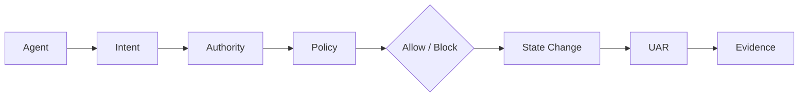

# Under the Hood — 8-Step Evidence Chain

Nexus Shield maps every governed action to **inspectable source modules** in this repository. No cloud dependency is required for the data plane path.

```
Agent → Intent → Authority → Policy → Allow/Block → State Change → UAR → Evidence
```



| Step | What happens | Repository module(s) |
|------|----------------|----------------------|
| **1. Agent** | Host or MCP client proposes a tool call | [`nexus-reference-app/sample_agent.py`](../nexus-reference-app/sample_agent.py), [`deployments/enterprise-demo/mock_langchain_agent.py`](../deployments/enterprise-demo/mock_langchain_agent.py) |
| **2. Intent** | Declared user/agent intent captured at intercept time | [`enterprise/data_plane_api.py`](../enterprise/data_plane_api.py) (`InterceptRequest.user_intent`) |
| **3. Authority** | Tenant RBAC + actor identity | [`enterprise/tenant_manager.py`](../enterprise/tenant_manager.py), [`enterprise/cloud_panel.py`](../enterprise/cloud_panel.py) (`process_agent_action`) |
| **4. Policy** | Risk scoring, allowlists, divergence rules | [`harness/core/policy_engine.py`](../harness/core/policy_engine.py), evolved rules in [`nexus/evolution.py`](../nexus/evolution.py) + [`nexus/policy.yml`](../nexus/policy.yml) |
| **5. Allow / Block** | `ALLOW` · `BLOCK` · `READ_ONLY` · `REQUIRE_APPROVAL` | [`enterprise/cloud_panel.py`](../enterprise/cloud_panel.py), dashboard [`lib/engine/action-firewall/`](../nexus-shield-dashboard/lib/engine/action-firewall/) |
| **6. State Change** | Before/after execution state hashes | [`enterprise/evidence_chain.py`](../enterprise/evidence_chain.py), receipt builders in [`packages/python/nexus_shield/action_receipt.py`](../packages/python/nexus_shield/action_receipt.py) |
| **7. UAR** | Universal Action Receipt sealed and stored | [`enterprise/uar_store.py`](../enterprise/uar_store.py), schema [`docs/UAR_SCHEMA.md`](./UAR_SCHEMA.md) |
| **8. Evidence** | SHA-256 `evidence_hash`, verify URLs, SIEM export | [`enterprise/siem_exporter.py`](../enterprise/siem_exporter.py), public [`/verify`](https://nexus-shield-dashboard.vercel.app/verify) |

## Reference stack (Phase 1)

```bash
docker compose -f docker-compose.nexus-reference.yml up --build
# or
docker compose -f nexus-reference-app/docker-compose.yml up --build
```

Services: **sample-agent** → **nexus-sidecar** (`POST /v1/intercept`) → **UAR ledger**; **mcp-server** simulates MCP tool discovery on `:8100`.

## Self-healing edge (local memory)

| Concern | Module |
|---------|--------|
| Encrypted anomaly ledger | [`nexus/memory.py`](../nexus/memory.py) |
| Runtime policy patches + rollback | [`nexus/evolution.py`](../nexus/evolution.py) |
| CI / Action verifier loop | [`.github/actions/verify/verify.py`](../.github/actions/verify/verify.py) |

Related: [ARCHITECTURE_WHITE_PAPER.md](./ARCHITECTURE_WHITE_PAPER.md) · [integration-quickstart.md](./integration-quickstart.md)
